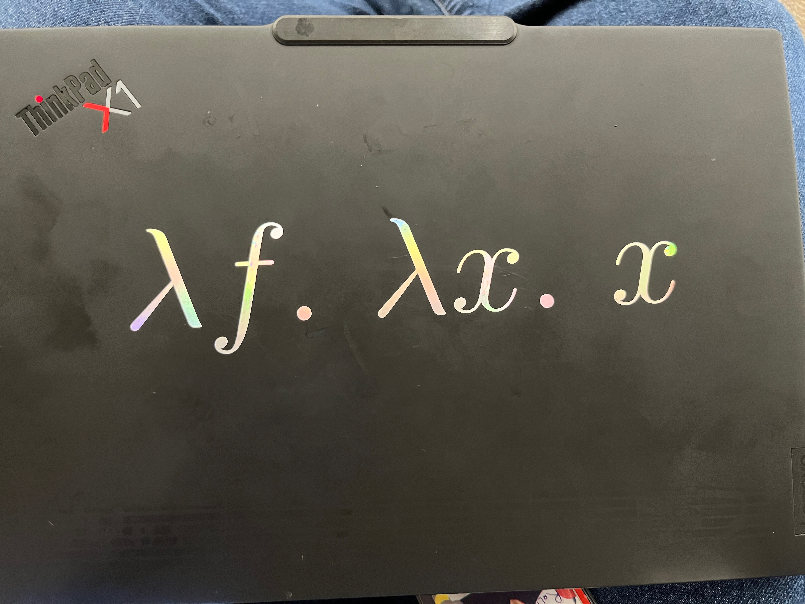

# Laptop Stickers

Custom vinyl stickers for laptop lids. Lambda calculus, Bach fugues,
Latin moral philosophy -- cut on a Cricut from holographic, metallic,
and matte vinyl.

## Current State

**ThinkPad X1 Carbon** -- holographic vinyl, Church encoding of zero:

> `λf. λx. x`

The identity function. *f* isn't doing anything. That's the point.

## Iterations

| # | Laptop | Sticker | Material | Description | Photo |
|---|--------|---------|----------|-------------|-------|
| 1 | Lenovo (old) | Y = λf. (λx. f(x x)) (λx. f(x x)) | White matte vinyl | Full Y-combinator in Computer Modern italic. Two lines, top of lid. |  |
| 1 | Lenovo (old) | Bach D♯ minor fugue (WTC II) | Gold metallic vinyl | Peters edition scan, vectorized. Bottom of lid. | (same photo) |
| 1 | Lenovo (old) | Assorted | Commercial stickers | Llama, aloha pineapple, DevFest 2023, etc. Middle cluster. | (same photo) |
| 2 | ThinkPad X1 | λf. λx. x | Holographic vinyl | Church zero. MVP. 10+ Cricut iterations to get weedable. 72 hours. Means nothing. |  |

## The Joke

Some clever but naive bro might look at it: "bro, *f* isn't doing
anything there; WTF?"

Correct. `λf. λx. x` is the Church numeral for **zero** -- the
function that takes *f* and *x* and applies *f* zero times, returning
*x* unchanged. It is the lambda calculus encoding of *nothing*.

72 hours of work, 10+ Cricut iterations, holographic vinyl that
someone described as "catamite-adjacent" -- all for something which means
literally nothing.

Occam's Razor as troll: the simplest possible lambda expression that
still binds an unused variable.

## Abandoned / Deferred Ideas

- **Bach D♯ minor fugue** -- had it working on old laptop (gold
  vinyl); looked messy and unseasonable on the X1. Extensive analysis
  of phrase boundaries and color theory in NOTES.md.
- **Full Y-combinator** -- also on old laptop. Replaced by its
  spiritual opposite: zero.
- **"Molesta placidis, amica saevis"** -- Latin inscription in Pietra
  LP (Roman inscriptional capitals). Blood red flanking Church
  numerals. Font purchased, layout designed, not yet cut. See
  NOTES.md.
- **Church numeral pyramid** -- full pyramid of Church numerals 0-5
  in white. Multiple LaTeX iterations (church-a through church-s5).
  See TODO.md.

## Project Structure

- `NOTES.md` -- technical findings, color theory, font research,
  vinyl cutting experiments
- `TODO.md` -- task tracking and layout plans
- `*.tex` / `*.ly` -- LaTeX and LilyPond source files for sticker
  designs
- `*.svg` / `*.pdf` -- vector outputs for Cricut
- `tex-to-sticker.sh` -- LaTeX to cropped sticker pipeline
- `lilypond-to-vinyl.sh` -- LilyPond to vinyl-ready SVG
- `png-to-svg-potrace.sh` -- raster to vector with quality presets
- `laptop.jpg` -- old Lenovo laptop
- `laptop-x1.jpg` -- current ThinkPad X1
